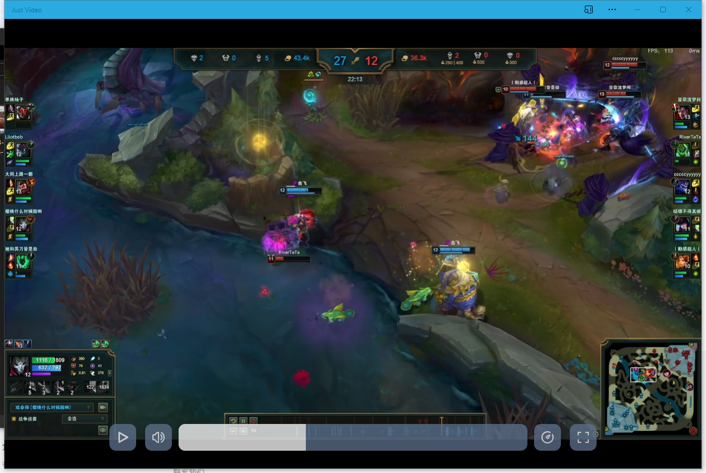

# Just-Video
Just-Video is a local video player developed on the Web.

> The shortcut logic of Chrome OS native video player is too counter-intuitive, so I developed this video player that can run on Chrome OS.

Just-Video has a minimalist design style and uses the `<video>` tag that comes with the web browser to play videos. On this basis, only the shortcut key function is added. 

To accommodate all **Chromebooks** and **Chrome OS flex** devices, Just-Video will offer touchscreen support in the future.

The frontend branch is Just a just-video front-end repository that allows users to install it locally as a PWA application. However, you need to configure the HTTPS server yourself, and this repository does not provide any cloud services.

## Usage

> Make sure the Node.js environment is configured on your server.

1. Clone this repository to your server

   ```bash
   git clone -b frontend https://github.com/See-Night/Just-Video.git
   ```

2. Install requirement

   ```bash
   cd Just-Video && npm install
   ```

3. Build

   ```bash
   npm run build
   ```

4. Configure HTTPs service

   > Take Nginx, for example :

   ```nginx
   server {
       listen      80;
       listen      [::]:443 ssl;
       server_name  "your hostname";
   
       ssl_certificate             /path/to/ssl.crt;
       ssl_certificate_key         /path/to/ssl.key;
       ssl_session_timeout         5m;
       ssl_protocols               TLSv1.2 TLSv1.3;
       ssl_ciphers                 ECDHE-RSA-AES128-GCM-SHA256:HIGH:!aNULL:!MD5:!RC4:!DHE;
       ssl_prefer_server_ciphers   on;
   
       # Replace this with the file directory you built above
       root /var/www;
       location / {
           try_files $uri $uri.html $uri/ =404;
       }
   
       error_page 404 /404.html;
       location = /404.html {
         internal;
       }
   
   }
   ```

5. Start HTTPs service

Then you can access Just-Video through your browser and install it as a PWA application.



<small>Just-Video sets the file association, you can directly select the opening method of the video file, or drag the video file into the Just-Video to play.</small>

## LICENSE

The repository adopts the LGPL-3.0 open source license, see the license [here](/LICENSE.md).

## Thanks

Just-Video is still a half-finished product, if you find bugs in the process of using, or you have better ideas and suggestions, please submit the Issue, thank you for your use and attention to Just-Video.
